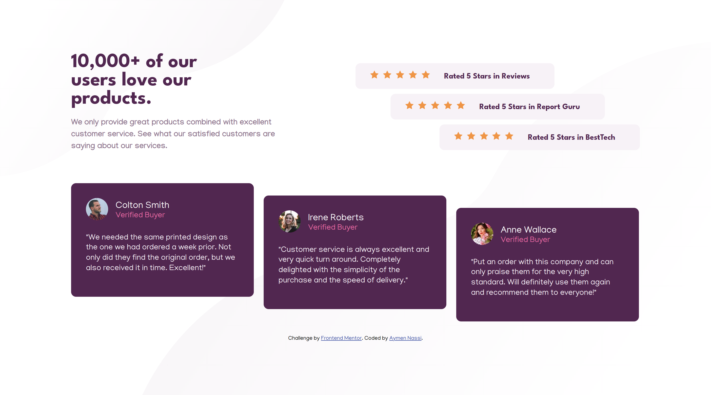
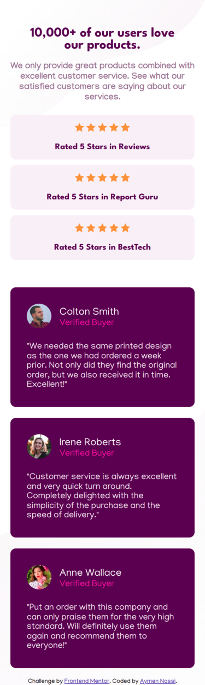

# Frontend Mentor - Social proof section solution

This is a solution to the [Social proof section challenge on Frontend Mentor](https://www.frontendmentor.io/challenges/social-proof-section-6e0qTv_bA). Frontend Mentor challenges help you improve your coding skills by building realistic projects.

### Screenshot

### Links

- [solution](https://www.frontendmentor.io/solutions/social-proof-section-9WZfnS-6G1)
- [live site](https://aymennassi.github.io/Social-proof-section/)

### Built with

- Semantic HTML5 markup
- CSS custom properties
- Flexbox
- CSS Grid
- Mobile-first workflow

## Author

- Linkedin - [Aymen Nassi](https://www.linkedin.com/in/aymen-nassi/)
